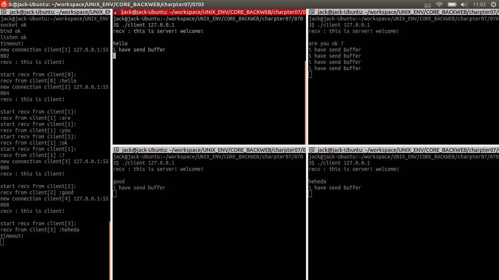
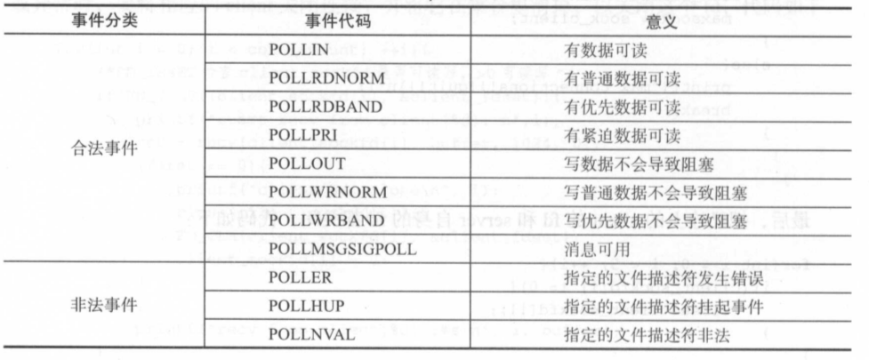
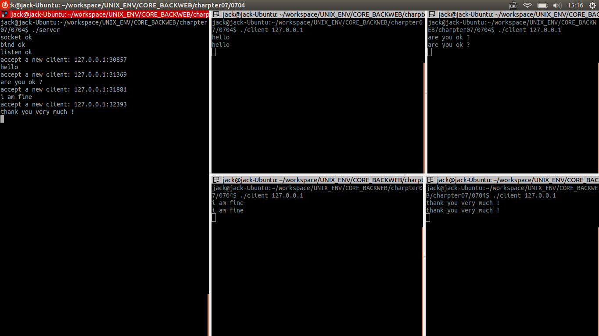

## 非阻塞IO模型 ##

### 1.select ###

#### (1)select 函数原型 ####

```cpp
    int select (int rnaxfdp, fd_set *readfds, fd_set *writefds, fd_set *errorfds, struct tirneval*tirneout);
```

这里面用到了两个结构体:fd_set和timeval。结构体fd_set可以理解为一个集合,这个集合中存放的是文件描述符(file descriptor),即文件句柄,这可以认为是常说的普通意义的文件;当然UNIX下任何设备、管道、FIFO等都是文件形式,所以毫无疑问,一个socket就是一个文件,socket句柄就是一个文件描述符。fd_set 集合可以通过一些宏由人为来操作,比如以下代码:

```cpp
fd_set set;
FD_ZERO(&set); /*将 set 清零*/
FD_SET(fd, &set); /*将 fd 加入 set */
FD_CLR(fd, &set); /*将 fd 从 set 中清除*/
FD_ISSET(fd, &set); /*如果 fd 在 set 中则真 */
```

结构体timeval是一个常用的结构,用来代表时间值,有两个成员,一个是秒数,另一个是毫秒数。

select的各个参数所表示的含义,如下所述:

- maxfdp 是一个整数值,是指集合中所有文件描述符的范围,即所有文件描述符的最
大值加1。
- readfds是指向fd_set结构的指针,这个集合中应该包括文件描述符。因为要监视文件描述符的读变化的,即关心是否可以从这些文件中读取数据,如果这个集合中有一个文件可读, select就会返回一个大于0 的值,表示有文件可读。如果没有可读的文件,则根据timeout参数再判断是否超时:若超出timeout的间, select返回0;若发生错误返回负值;也可以传入NULL值,表示不关心任何文件的读变化。
- writefds是指向fd_set 结构的指针,这个集合中应该包括文件描述符。因为要监视文件描述符的写 变化的,即关心是否可以向这些文件中写入数据,如果这个集合中有一个文件可写, select 就会返回一个大于0的值,表示有文件可写。如果没有可写的文件,则根据timeout参数再判断是否超时:若超出timeout 的时间,select返回0;若发生错误返回负值;也可以传入NULL值,表示不关心任何文件的写变化 。
- errorfds同上面两个参数的意图,用来监视文件错误异常。
- timeout是select的超时时间,这个参数至关重要,它可以使select处于3种状态:
1-若将NULL以形参传入,即不传入时间结构,就是将select置于阻塞状态,一定等到监视文件描述符集合中某个文件描述符发生变化为止;2-若将时间值设为0,就变成一个纯粹的非阻塞函数,不管文件描述符是再有变化,都立刻返回继续执行,文件无变化返回0,有变化返回一个正值;3-timeout的值大于0,这就是等待的超时时间,即select在timeout时间内阻塞,超时时间之内有事件到来就返回了,否则在超时后不管怎样一定返回,返回值同上述。
- 返回值:准备就绪的描述符数,若超时则返回0,若出错则返回-1。

#### (2)使用 select 函数循环读取键盘输入 ####

```cpp
#include <sys/time.h>  
#include <stdio.h>  
#include <sys/types.h>  
#include <sys/stat.h>  
#include <fcntl.h>  
#include <assert.h>  
#include <stdlib.h>
#include <string.h>
#include <unistd.h>
#include <sys/socket.h>
#include <netinet/in.h>
#include <arpa/inet.h>
#include <errno.h>
#include <sys/select.h>
int main(){
	int keyboard;  
	int ret,i;  
	char c;  
	fd_set readfd;  
	struct timeval timeout;
	keyboard = open("/dev/tty",O_RDONLY | O_NONBLOCK); 
	assert(keyboard>0);  
	while(1){
		timeout.tv_sec=1; 
		timeout.tv_usec=0; 
		FD_ZERO(&readfd);  
		FD_SET(keyboard,&readfd);
		ret=select(keyboard+1,&readfd,NULL,NULL,&timeout); 
		if(FD_ISSET(keyboard,&readfd)) {
			i=read(keyboard,&c,1);  
			if('\n'==c)  
				continue;  
			printf("The input is %c\n",c);  
			if ('q'==c)  
				break;  
		}
	}
    return 0;
}
```

编译运行结果如下:

    jack@jack-Ubuntu:~/workspace/UNIX_ENV/CORE_BACKWEB/charpter07/0701$ gcc keyboard.cpp
    jack@jack-Ubuntu:~/workspace/UNIX_ENV/CORE_BACKWEB/charpter07/0701$ ./a.out
    hello
    The input is h
    The input is e
    The input is l
    The input is l
    The input is o
    q
    The input is q

下面来具体看下程序里都写了哪些功能。

	open("/dev/tty", O_RDONLY | O_ NONBLOCK);

/dev/tty当前终端,任何tty(任何类型的终端设备), echo"hello" > /dev/tty 都会直接显示在当前的终端中。O_RDONLY指只读方式, O_NONBLOCK指非阻塞方式。综合起来就是,非阻塞地读取终端上的输入信息。

	assert(keyboard>O);

assert宏的原型定义在<assert.h>中,其作用是如果它的条件返回错误,则终止程序执行,原型定义如下所示:

    #include <assert.h>
    void assert(int expression);

assert的作用是计算表达式expression,如果其值为假(即为0),那么它先向stderr打印一条出错信息,然后通过调用abort 终止程序运行。

或者说,打开终端后会返回一个文件描述符,如果这个文件描述符小于等于0,就表示打开失败,失败就得退出程序。

    timeout.tv_sec=l ;
    timeout.tv_usec=O;
    FD_ZERO(&readfd);
    FD_SET(keyboard, &readfd);
    ret=select(keyboard+l ,&readfd , NULL, NULL, &timeout);

超时时间设为ls,把可读的fd集合都清空,再把打开终端的描述符加入到可读描述符集合中,调用 select 函数查看是否有可读的fd。

    if(FD_ISSET(keyboard,&readfd)) {
        i=read(keyboard,&c,1);  
        if('\n'==c)  
            continue;  
        printf("The input is %c\n",c);  
        if ('q'==c)  
            break;  
    }

如果终端的描述符在可读描述符集合中,就开始读取数据,如果读到的字符是\n,即换行符,则继续 ;如果读到的字符是q,就退出;否则就输出该字符。这样就实现了循环读取了键盘的输入。但是,这里设置的超时时间似乎没有派上用场,这是由于没有判断select的返回值导致的。下面案例即把select的返回值做了判断,可以比较来看。

#### (3)观察select超时时的表现 ####

```cpp
#include <sys/time.h>  
#include <stdio.h>  
#include <sys/types.h>  
#include <sys/stat.h>  
#include <fcntl.h>  
#include <assert.h>  
#include <stdlib.h>
#include <string.h>
#include <unistd.h>
#include <sys/socket.h>
#include <netinet/in.h>
#include <arpa/inet.h>
#include <errno.h>
#include <sys/select.h>
int main(){
	int keyboard; 
	int ret,i; 
	char c;
	fd_set readfd;
	struct timeval timeout;
	keyboard = open("/dev/tty",O_RDONLY | O_NONBLOCK);
	assert(keyboard>0);
	while(1) {
		timeout.tv_sec=5;
		timeout.tv_usec=0;
		FD_ZERO(&readfd);
		FD_SET(keyboard,&readfd);
		ret=select(keyboard+1,&readfd,NULL,NULL,&timeout);
		if (ret == -1)
			perror("select error");
		else if (ret){
			if(FD_ISSET(keyboard,&readfd)){
				i=read(keyboard,&c,1);
				if('\n'==c)
					continue;
				printf("hehethe input is %c\n",c);
				if ('q'==c)
					break;
			}  
        }else if (ret == 0)
            printf("time out\n");
	}
	return 0;
}  
```

编译运行结果如下:

    jack@jack-Ubuntu:~/workspace/UNIX_ENV/CORE_BACKWEB/charpter07/0702$ gcc keyboard.cpp
    jack@jack-Ubuntu:~/workspace/UNIX_ENV/CORE_BACKWEB/charpter07/0702$ ./a.out
    h
    hehethe input is h
    time out
    time out
    3
    hehethe input is 3
    time out
    ctime out

    hehethe input is c
    q
    hehethe input is q

ret值是select函数的返回值。如果ret的值为-1,即代表select函数调用失败;如果ret的值为0,则代表等待时间超时,此时仍然没有可读或可写的描述符,则程序打印出timeout,提示已超时。

#### (4)使用 select 函数提高服务器的处理能力 ####

client.cpp 如下:

```cpp
#include <stdio.h>
#include <stdlib.h>
#include <string.h>
#include <unistd.h>
#include <sys/types.h>
#include <sys/socket.h>
#include <netinet/in.h>
#include <arpa/inet.h>
#include <errno.h>
#define DEFAULT_PORT 6666
int main( int argc, char * argv[]){
    int connfd = 0;
    int cLen = 0;
    struct sockaddr_in client;
    if(argc < 2){
        printf(" Uasge: clientent [server IP address]\n");
        return -1;
    }	
    client.sin_family = AF_INET;
    client.sin_port = htons(DEFAULT_PORT);
    client.sin_addr.s_addr = inet_addr(argv[1]);
    connfd = socket(AF_INET, SOCK_STREAM, 0);
    if(connfd < 0){
	    perror("socket" );
        return -1;
    }
    if(connect(connfd, (struct sockaddr*)&client, sizeof(client)) < 0){
 	    perror("connect" );
        return -1;
    }
	char buffer[1024];
	bzero(buffer,sizeof(buffer));
	recv(connfd, buffer, 1024, 0);
	printf("recv : %s\n", buffer);
	bzero(buffer,sizeof(buffer));
	strcpy(buffer,"this is client!\n");
	send(connfd, buffer, 1024, 0);
	while(1){
		bzero(buffer,sizeof(buffer));
		scanf("%s",buffer);
		int p = strlen(buffer);
		buffer[p] = '\0';
		send(connfd, buffer, 1024, 0);
		printf("i have send buffer\n");
	}
	close(connfd);
	return 0;
}
```

server.cpp如下:

```cpp
#include <sys/types.h>
#include <sys/socket.h>
#include <netinet/in.h>
#include <arpa/inet.h>
#include <unistd.h>
#include <stdio.h>
#include <stdlib.h>
#include <strings.h>
#include <sys/wait.h>
#include <string.h>
#include <errno.h>
#define DEFAULT_PORT 6666
int main( int argc, char ** argv){
    int serverfd,acceptfd; /* 监听socket: serverfd,数据传输socket: acceptfd */
    struct sockaddr_in my_addr; /* 本机地址信息 */
    struct sockaddr_in their_addr; /* 客户地址信息 */
    unsigned int sin_size, myport=6666, lisnum=10;
    if ((serverfd = socket(AF_INET , SOCK_STREAM, 0)) == -1) {
       perror("socket" );
       return -1;
    }
    printf("socket ok \n");
    my_addr.sin_family=AF_INET;
    my_addr.sin_port=htons(DEFAULT_PORT);
    my_addr.sin_addr.s_addr = INADDR_ANY;
    bzero(&(my_addr.sin_zero), 0);
    if (bind(serverfd, (struct sockaddr *)&my_addr, sizeof(struct sockaddr )) == -1) {
        perror("bind" );
        return -2;
    }
    printf("bind ok \n");
    if (listen(serverfd, lisnum) == -1) {
        perror("listen" );
        return -3;
    }
    printf("listen ok \n");
	
	fd_set client_fdset;	/*监控文件描述符集合*/
	int maxsock;            /*监控文件描述符中最大的文件号*/
	struct timeval tv;		/*超时返回时间*/
	int client_sockfd[5];   /*存放活动的sockfd*/
	bzero((void*)client_sockfd,sizeof(client_sockfd));
	int conn_amount = 0;    /*用来记录描述符数量*/
	maxsock = serverfd;
	char buffer[1024];
	int ret=0;
	while(1){
		/*初始化文件描述符号到集合*/
		FD_ZERO(&client_fdset);
		/*加入服务器描述符*/
		FD_SET(serverfd,&client_fdset);
		/*设置超时时间*/
		tv.tv_sec = 30; /*30秒*/
		tv.tv_usec = 0;
		/*把活动的句柄加入到文件描述符中*/
		for(int i = 0; i < 5; ++i){
			/*程序中Listen中参数设为5,故i必须小于5*/
			if(client_sockfd[i] != 0){
				FD_SET(client_sockfd[i], &client_fdset);
			}
		}
		/*printf("put sockfd in fdset!\n");*/
		/*select函数*/
		ret = select(maxsock+1, &client_fdset, NULL, NULL, &tv);
		if(ret < 0){
			perror("select error!\n");
			break;
		}
		else if(ret == 0){
			printf("timeout!\n");
			continue;
		}
		/*轮询各个文件描述符*/
		for(int i = 0; i < conn_amount; ++i){
			/*FD_ISSET检查client_sockfd是否可读写，>0可读写*/
			if(FD_ISSET(client_sockfd[i], &client_fdset)){
					printf("start recv from client[%d]:\n",i);
					ret = recv(client_sockfd[i], buffer, 1024, 0);
					if(ret <= 0){
					printf("client[%d] close\n", i);
					close(client_sockfd[i]);
					FD_CLR(client_sockfd[i], &client_fdset);
					client_sockfd[i] = 0;
				}
				else{
					printf("recv from client[%d] :%s\n", i, buffer);
				}
			}
		}
		/*检查是否有新的连接，如果收，接收连接，加入到client_sockfd中*/
		if(FD_ISSET(serverfd, &client_fdset)){
			/*接受连接*/
			struct sockaddr_in client_addr;
			size_t size = sizeof(struct sockaddr_in);

			int sock_client = accept(serverfd, (struct sockaddr*)(&client_addr), (unsigned int*)(&size));

			if(sock_client < 0){
				perror("accept error!\n");
				continue;
			}

			/*把连接加入到文件描述符集合中*/
			if(conn_amount < 5){
				client_sockfd[conn_amount++] = sock_client;
				bzero(buffer,1024);
				strcpy(buffer, "this is server! welcome!\n");
				send(sock_client, buffer, 1024, 0);
				printf("new connection client[%d] %s:%d\n", conn_amount, inet_ntoa(client_addr.sin_addr), ntohs(client_addr.sin_port));
				bzero(buffer,sizeof(buffer));
				ret = recv(sock_client, buffer, 1024, 0);
				if(ret < 0){
					perror("recv error!\n");
					close(serverfd);
					return -1;
				}

				printf("recv : %s\n",buffer);
				
				if(sock_client > maxsock){
					maxsock = sock_client;
				}
				else{
					printf("max connections!!!quit!!\n");
					break;
				}
			}
		}
	}

	for(int i = 0; i < 5; ++i){
		if(client_sockfd[i] != 0){
			close(client_sockfd[i]);
		}
	}

	close(serverfd);
	return 0;	
}
```

makefile如下:

    all:server client
    server:server.o
        g++ -g -o server server.o
    client:client.o
        g++ -g -o client client.o
    server.o:server.cpp
        g++ -g -c server.cpp
    client.o:client.cpp
        g++ -g -c client.cpp
    clean:all
        rm all

编译运行结果如下:



下面来具体分析程序各部分内容。

server.cpp中,获得监昕描述符后,就开始了一个while循环。在这个while循环中,需要不断地查看是否有新client连接;已连上的client是否有发送消息过来。先初始化文件描述符集合,把服务器描述符加入到集合中,设置select的超时时间,代码如下所示:

    /*初始化文件描述符号到集合*/
    FD_ZERO(&client_fdset);
    /*加入服务器描述符*/
    FD_SET(serverfd,&client_fdset);
    /*设置超时时间*/
    tv.tv_sec = 30; /*30秒*/
    tv.tv_usec = 0;

把已经连上的client的fd也加入到集合中,方便检查是否有数据可读,代码如下:

    /*把活动的句柄加入到文件描述符中*/
    for(int i = 0; i < 5; ++i){
        /*程序中Listen中参数设为5,故i必须小于5*/
        if(client_sockfd[i] != 0){
            FD_SET(client_sockfd[i], &client_fdset);
        }
    }

调用select函数,注意要根据起返回值判断程序是否有异常,代码如下:

    ret = select(maxsock+1, &client_fdset, NULL, NULL, &tv);
    if(ret < 0){
        perror("select error!\n");
        break;
    }
    else if(ret == 0){
        printf("timeout!\n");
        continue;
    }

先看已连上的client的fd有无可读的数据,也就是有无数据可接收的,有就输出,没有或异常时,要将相应的client关闭连接,并将它在集合里清掉,以关闭这个fd,代码如下:

    /*轮询各个文件描述符*/
    for(int i = 0; i < conn_amount; ++i){
        /*FD_ISSET检查client_sockfd是否可读写，>0可读写*/
        if(FD_ISSET(client_sockfd[i], &client_fdset)){
                printf("start recv from client[%d]:\n",i);
                ret = recv(client_sockfd[i], buffer, 1024, 0);
                if(ret <= 0){
                printf("client[%d] close\n", i);
                close(client_sockfd[i]);
                FD_CLR(client_sockfd[i], &client_fdset);
                client_sockfd[i] = 0;
            }
            else{
                printf("recv from client[%d] :%s\n", i, buffer);
            }
        }
    }

检查是否有新的连接,如果有,建立接收连接,加入到client_sockfd中,发送一个消息给client,方便看到client已经连上了。并且,还需要把 max_sock 更新,因为下一次进入while循环调用select时,需要传当前最大的fd值+1 给select函数。相关代码如下所示:

    /*检查是否有新的连接，如果收，接收连接，加入到client_sockfd中*/
    if(FD_ISSET(serverfd, &client_fdset)){
        /*接受连接*/
        struct sockaddr_in client_addr;
        size_t size = sizeof(struct sockaddr_in);

        int sock_client = accept(serverfd, (struct sockaddr*)(&client_addr), (unsigned int*)(&size));

        if(sock_client < 0){
            perror("accept error!\n");
            continue;
        }

        /*把连接加入到文件描述符集合中*/
        if(conn_amount < 5){
            client_sockfd[conn_amount++] = sock_client;
            bzero(buffer,1024);
            strcpy(buffer, "this is server! welcome!\n");
            send(sock_client, buffer, 1024, 0);
            printf("new connection client[%d] %s:%d\n", conn_amount, inet_ntoa(client_addr.sin_addr), ntohs(client_addr.sin_port));
            bzero(buffer,sizeof(buffer));
            ret = recv(sock_client, buffer, 1024, 0);
            if(ret < 0){
                perror("recv error!\n");
                close(serverfd);
                return -1;
            }

            printf("recv : %s\n",buffer);

            if(sock_client > maxsock){
                maxsock = sock_client;
            }
            else{
                printf("max connections!!!quit!!\n");
                break;
            }
        }
    }

最后,把已连上的client的fd和server自身的fd都关闭,代码如下:

	for(int i = 0; i < 5; ++i){
		if(client_sockfd[i] != 0){
			close(client_sockfd[i]);
		}
	}

	close(serverfd);

如此,sever就能同时处理多个client的请求,达到提供处理能力的效果。而client.cpp 中,也是连上 server后开始发数据,但这部分比较简单。

### 2.poll ###

#### (1)poll 函数原型 ####

和select函数一样,poll函数也可以用于执行多路复用IO。poll所需要的头文件和函数原型如下所示:

    #include<poll.h>
    int poll(struct pollfd * fds,unsigned int timeout);

pollfd结构体定义如下所示:

    struct pollfd {
        int fd; /*文件描述符*/
        short events;/*等待的事件*/
        short events;/*实际发生的事件*/
    }

每一个pollfd结构体指定了一个被监视的文件描述符,可以传递多个结构体,指示poll()监视多个文件描述符。每个结构体的events域是监视该文件描述符的事件掩码,由用户来设置这个域的属性。revents域是文件描述符的操作结果事件掩码,内核在调用返回时设置这个域;并且events域中请求的任何事件都可能在revents域中返回。具体的事件代码和代表的含义如下图所示:



实际上这些事件在events域中无意义因为它们总会在合适的时候从revents中返回。

使用poll()和select()不一样,不需要显式地请求异常情况报告。

POLLIN | POLLPRI等价于select()的读事件,POLLOUT | POLLWRBAND等价于select()的写事件;POLLIN等价于POLLRDNORM | POLLRDBAND,而POLLOUT则等价于POLLWRNORM。例如,要同时监视一个文件描述符是否可读或可写,可以设置events为POLLIN | POLLOUT。在poll返回时,只要检查revents中的标志,获得对应于文描述符请求的events结构体。如果POLLIN事件被设置,则文件描述符可以被读取而不阻塞;如果POLLOUT 被设置,则文件描述符可以写入而不导致阻塞。这些标志并不是互斥的:它们可能被同时设置,表示这个文件描述符的读取和写人操作都会正常返回而不阻塞。timeout参数指定等待的毫秒数,无论IO是否准备好,poll都会返回。

nfds大小则决定了fds数组的长度。

timeout指定为负数值时表示无限超时,使poll()一直挂起直到一个指定事件发生; timeout为0指示poll调用立即返回并列出准备好IO的文件描述符,但并不等待其他的事件。这种情况下, poll()的返回值,一旦被选举出来,立即返回。成功时,poll()返回结构体中revents域不为0的文件描述符个数:如果在超时前没有任何事件发生,poll()返回0。失败时,poll()返回-1,并设置errno为下列值之一:

(1) EBADF : 一个或多个结构体中指定 的文件描述符无效。

(2) EFAULTfds :指针指向的地址超出进程的地址空间。

(3) EINTR : 请求的事件之前产生一个信号,调用可以重新发起。

(4) EINVALnfds : 参数超出 PLIMIT_NOFILE值。

(5) ENOMEM :可用内存不足,无法完成请求。

#### (2)使用 poll 函数提高服务器处理能力 ####

client.cpp

```cpp
#include <sys/types.h>
#include <sys/socket.h>
#include <netinet/in.h>
#include <arpa/inet.h>
#include <unistd.h>
#include <stdio.h>
#include <stdlib.h>
#include <strings.h>
#include <sys/wait.h>
#include <string.h>
#include <errno.h>
#include <poll.h>
#define MAXLINE     1024
#define DEFAULT_PORT   6666
#define max(a,b) (a > b) ? a : b
static void handle_connection(int sockfd);
int main(int argc,char *argv[]){
	int connfd = 0;
    int cLen = 0;
    struct sockaddr_in client;
    if(argc < 2){
        printf(" Uasge: clientent [server IP address]\n");
        return -1;
    }	
    client.sin_family = AF_INET;
    client.sin_port = htons(DEFAULT_PORT);
    client.sin_addr.s_addr = inet_addr(argv[1]);
    connfd = socket(AF_INET, SOCK_STREAM, 0);
    if(connfd < 0){
		perror("socket" );
        return -1;
    }
    if(connect(connfd, (struct sockaddr*)&client, sizeof(client)) < 0){
 		perror("connect" );
        return -1;
    }
    /*处理连接描述符*/
    handle_connection(connfd);
    return 0;
}
static void handle_connection(int sockfd){
    char    sendline[MAXLINE],recvline[MAXLINE];
    int     maxfdp,stdineof;
    struct pollfd pfds[2];
    int n;
    /*添加连接描述符*/
    pfds[0].fd = sockfd;
    pfds[0].events = POLLIN;
    /*添加标准输入描述符*/
    pfds[1].fd = STDIN_FILENO;
    pfds[1].events = POLLIN;
    while(1){
        poll(pfds,2,-1);
        if (pfds[0].revents & POLLIN){
            n = read(sockfd,recvline,MAXLINE);
            if (n == 0){
                    fprintf(stderr,"client: server is closed.\n");
                    close(sockfd);
            }
            write(STDOUT_FILENO,recvline,n);
        }
        /*测试标准输入是否准备好*/
        if (pfds[1].revents & POLLIN) {
            n = read(STDIN_FILENO,sendline,MAXLINE);
            if (n  == 0) {
                shutdown(sockfd,SHUT_WR);
				continue;
            }
            write(sockfd,sendline,n);
        }
    }
}
```

server.cpp

```cpp
#include <sys/types.h>
#include <sys/socket.h>
#include <netinet/in.h>
#include <arpa/inet.h>
#include <unistd.h>
#include <stdio.h>
#include <stdlib.h>
#include <strings.h>
#include <sys/wait.h>
#include <string.h>
#include <errno.h>
#include <poll.h>
#define IPADDRESS   "127.0.0.1"
#define PORT        6666
#define MAXLINE     1024
#define LISTENQ     5
#define OPEN_MAX    1000
#define INFTIM      -1

/*创建套接字,进行绑定和监听*/
int bind_and_listen(){
	int serverfd; /* 监听socket: serverfd*/
    struct sockaddr_in my_addr; /* 本机地址信息 */
    unsigned int sin_size;
    if ((serverfd = socket(AF_INET , SOCK_STREAM, 0)) == -1) {
       perror("socket" );
       return -1;
    }
    printf("socket ok \n");	
    my_addr.sin_family=AF_INET;
    my_addr.sin_port=htons(PORT);
    my_addr.sin_addr.s_addr = INADDR_ANY;
    bzero(&(my_addr.sin_zero), 0);
    if (bind(serverfd, (struct sockaddr *)&my_addr, sizeof(struct sockaddr )) == -1) {
        perror("bind" );
        return -2;
    }
    printf("bind ok \n");
    if (listen(serverfd, LISTENQ) == -1) {
        perror("listen" );
        return -3;
    }
    printf("listen ok \n");
	return serverfd;
}

/*IO多路复用poll*/
void do_poll(int listenfd){
    int  connfd,sockfd;
    struct sockaddr_in cliaddr;
    socklen_t cliaddrlen;
    struct pollfd clientfds[OPEN_MAX];
    int maxi;
    int i;
    int nready;
    /*添加监听描述符*/
    clientfds[0].fd = listenfd;
    clientfds[0].events = POLLIN;
    /*初始化客户连接描述符*/
    for (i = 1;i < OPEN_MAX;i++)
        clientfds[i].fd = -1;
    maxi = 0;
    /*循环处理*/
    while(1){
        /*获取可用描述符的个数*/
        nready = poll(clientfds,maxi+1,INFTIM);
        if (nready == -1){
            perror("poll error:");
            exit(1);
        }

        /*测试监听描述符是否准备好*/
        if (clientfds[0].revents & POLLIN){
            cliaddrlen = sizeof(cliaddr);

        /*接受新的连接*/
        if ((connfd = accept(listenfd,(struct sockaddr*)&cliaddr,&cliaddrlen)) == -1){
            if (errno == EINTR)
                continue;
            else{
                perror("accept error:");
                exit(1);
            }
        }

        fprintf(stdout,"accept a new client: %s:%d\n", inet_ntoa(cliaddr.sin_addr), cliaddr.sin_port );

        /*将新的连接描述符添加到数组中*/
        for (i = 1;i < OPEN_MAX;i++){
            if (clientfds[i].fd < 0){
                clientfds[i].fd = connfd;
                break;
            }
        }

        if (i == OPEN_MAX){
            fprintf(stderr,"too many clients.\n");
            exit(1);
        }

        /*将新的描述符添加到读描述符集合中*/
        clientfds[i].events = POLLIN;
        /*记录客户连接套接字的个数*/
        maxi = (i > maxi ? i : maxi);
        if (--nready <= 0)
            continue;
        }

        /*处理多个连接上客户端发来的包*/
        char buf[MAXLINE];
        memset(buf,0,MAXLINE);
        int readlen=0;
        for (i = 1;i <= maxi;i++){
            if (clientfds[i].fd < 0)
                continue;
            
            /*测试客户描述符是否准备好*/
            if (clientfds[i].revents & POLLIN){
                /*接收客户端发送的信息*/
                readlen = read(clientfds[i].fd,buf,MAXLINE);
                if (readlen == 0){
                    close(clientfds[i].fd);
                    clientfds[i].fd = -1;
                    continue;
                }
                /*printf("read msg is: ");*/
                write(STDOUT_FILENO,buf,readlen);
                /*向客户端发送buf*/
                write(clientfds[i].fd,buf,readlen);
            }
        }
    }
}

int main(int argc,char *argv[]){
    int  listenfd=bind_and_listen();

	if(listenfd<0){
	    return 0;
	}

    do_poll(listenfd);
    
    return 0;
}
```

makefile

    all:server client
    server:server.o
        g++ -g -o server server.o
    client:client.o
        g++ -g -o client client.o
    server.o:server.cpp
        g++ -g -c server.cpp
    client.o:client.cpp
        g++ -g -c client.cpp
    clean:all
        rm all

编译运行结果如下:



上面例中,编写了一个echo server程序,功能是客户端向服务器发送消息,服务器接收输出并原样返回客户端,客户端接收到消息后输出到终端。

server.cpp中,方便阅读,把套接字的创建、绑定和监昕,都写在了一个函数中:

    /*创建套接字,进行绑定和监听*/
    int bind_and_listen(){
        int serverfd; /* 监听socket: serverfd*/
        struct sockaddr_in my_addr; /* 本机地址信息 */
        unsigned int sin_size;
        if ((serverfd = socket(AF_INET , SOCK_STREAM, 0)) == -1) {
           perror("socket" );
           return -1;
        }
        printf("socket ok \n");	
        my_addr.sin_family=AF_INET;
        my_addr.sin_port=htons(PORT);
        my_addr.sin_addr.s_addr = INADDR_ANY;
        bzero(&(my_addr.sin_zero), 0);
        if (bind(serverfd, (struct sockaddr *)&my_addr, sizeof(struct sockaddr )) == -1) {
            perror("bind" );
            return -2;
        }
        printf("bind ok \n");
        if (listen(serverfd, LISTENQ) == -1) {
            perror("listen" );
            return -3;
        }
        printf("listen ok \n");
        return serverfd;
    }

先把服务器的描述符加入到描述符集合中,需要注意的是,select所用的描述符集合是一个fd_set的结构体中,而poll的描述符却是在一个以pollfd为元素的数组中,代码如下:

    /*添加监听描述符*/
    clientfds[0].fd = listenfd;
    clientfds[0].events = POLLIN;

接下来将数组初始化,注意别把第一个元素给覆盖了,因为第一个已添加了服务器描述符。所以i是从1开始,而不是从0开始,代码如下:

    /*初始化客户连接描述符*/
    for (i = 1;i < OPEN_MAX;i++)
        clientfds[i].fd = -1;

接着是一个while循环,查看是否有新客户端连接,或者老客户端是否有数据发送过来。这里的超时时间设为-1,表示无限超时,使poll()一直挂起直到一个指定事件发生。而maxi就是clientfds数组中最大的下标。有新client接人时,判断是否放在了比较大的下标位置,如果是的话要就修改maxi的值,如果放在了已经断掉连接的下标位置,则不用更新,代码如下:

    /*获取可用描述符的个数*/
    nready = poll(clientfds,maxi+1,INFTIM);
    if (nready == -1){
        perror("poll error:");
        exit(1);
    }

当有新的客户端连接时,必须接受,获得新的fd,并将新fd放到数组中,代码如下:

    /*测试监听描述符是否准备好*/
    if (clientfds[0].revents & POLLIN){
        cliaddrlen = sizeof(cliaddr);

    /*接受新的连接*/
    if ((connfd = accept(listenfd,(struct sockaddr*)&cliaddr,&cliaddrlen)) == -1){
        if (errno == EINTR)
            continue;
        else{
            perror("accept error:");
            exit(1);
        }
    }

    fprintf(stdout,"accept a new client: %s:%d\n", inet_ntoa(cliaddr.sin_addr), cliaddr.sin_port );

    /*将新的连接描述符添加到数组中*/
    for (i = 1;i < OPEN_MAX;i++){
        if (clientfds[i].fd < 0){
            clientfds[i].fd = connfd;
            break;
        }
    }

    if (i == OPEN_MAX){
        fprintf(stderr,"too many clients.\n");
        exit(1);
    }

    /*将新的描述符添加到读描述符集合中*/
    clientfds[i].events = POLLIN;
    /*记录客户连接套接字的个数*/
    maxi = (i > maxi ? i : maxi);
    if (--nready <= 0)
        continue;
    }

client.cpp值得仔细看一下,这里也用了poll函数进行读写操作。判断是否有数据可读,需要检查两个来源:1-服务器是否发来了包;2-标准输入中是否有输入。代码如下所示:

    struct pollfd pfds[2];
    int n;
    /*添加连接描述符*/
    pfds[0].fd = sockfd;
    pfds[0].events = POLLIN;
    /*添加标准输入描述符*/
    pfds[1].fd = STDIN_FILENO;
    pfds[1].events = POLLIN;
    while(1){
        poll(pfds,2,-1);
        if (pfds[0].revents & POLLIN){
            n = read(sockfd,recvline,MAXLINE);
            if (n == 0){
                    fprintf(stderr,"client: server is closed.\n");
                    close(sockfd);
            }
            write(STDOUT_FILENO,recvline,n);
        }
        /*测试标准输入是否准备好*/
        if (pfds[1].revents & POLLIN) {
            n = read(STDIN_FILENO,sendline,MAXLINE);
            if (n  == 0) {
                shutdown(sockfd,SHUT_WR);
				continue;
            }
            write(sockfd,sendline,n);
        }
    }

综上所述, poll函数也可让服务器具备同时处理多个客户端请求的能力。
