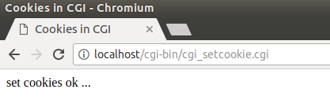

## CGI ##

### 1.CGI介绍 ###

#### (1)什么是 CGI？ ####

- 公共网关接口（CGI），是一套标准，定义了信息是如何在 Web 服务器和客户端脚本之间进行交换的。
- CGI 规范目前是由 NCSA 维护的，NCSA 定义 CGI 如下：
- 公共网关接口（CGI），是一种用于外部网关程序与信息服务器（如 HTTP 服务器）对接的接口标准。
- 目前的版本是 CGI/1.1，CGI/1.2 版本正在推进中。

#### (2)Web服务 ####

了更好地了解 CGI 的概念，可以点击一个超链接，浏览一个特定的网页或 URL，看看会发生什么。

- 浏览器联系上 HTTP Web 服务器，并请求 URL，即文件名。
- Web 服务器将解析 URL，并查找文件名。如果找到请求的文件，Web 服务器会把文件发送回浏览器，否则发送一条错误消息，表明您请求了一个错误的文件。
- Web 浏览器从 Web 服务器获取响应，并根据接收到的响应来显示文件或错误消息。

然而，以这种方式搭建起来的 HTTP 服务器，不管何时请求目录中的某个文件，HTTP 服务器发送回来的不是该文件，而是以程序形式执行，并把执行产生的输出发送回浏览器显示出来。

公共网关接口（CGI），是使得应用程序（称为 CGI 程序或 CGI 脚本）能够与 Web 服务器以及客户端进行交互的标准协议。这些 CGI 程序可以用 Python、PERL、Shell、C 或 C++ 等进行编写。

#### (3)CGI 架构 ####


### 2.安装Apache2(Ubuntu 14.04 LTS) ###

打开一个新的终端,输入如下命令来安装apache2:

	sudo apt-get install apache2

Apache的安装路径为/var,默认的网站根目录的路径为/var/www/html:


浏览器输入http://127.0.0.1 或者 http:localhost 来查看是否正常工作:


可以使用下面命令启动apache2服务:

	sudo /etc/init.d/apache2 start

可以使用下面命令停止apache2服务:

	sudo /etc/init.d/apache2 stop

可以使用下面命令重启apache2服务:

	sudo /etc/init.d/apache2 restart

### 3.Web 服务器配置 ###

安装完Apache后最重要的一件事情就是要知道Web文档的根目录在什么地方。对于Ubuntu而言，默认的是/var/www。但是apache2.conf里并没有描述，httpd.conf也是空的，最后发现是在/etc/apache2/sites-enabled/000-default中，里面有这样的内容：

    jack@jack-Ubuntu:/etc/apache2/sites-enabled$ cat 000-default.conf 
    <VirtualHost *:80>
        # The ServerName directive sets the request scheme, hostname and port that
        # the server uses to identify itself. This is used when creating
        # redirection URLs. In the context of virtual hosts, the ServerName
        # specifies what hostname must appear in the request's Host: header to
        # match this virtual host. For the default virtual host (this file) this
        # value is not decisive as it is used as a last resort host regardless.
        # However, you must set it for any further virtual host explicitly.
        #ServerName www.example.com

        ServerAdmin webmaster@localhost
        DocumentRoot /var/www/html

        # Available loglevels: trace8, ..., trace1, debug, info, notice, warn,
        # error, crit, alert, emerg.
        # It is also possible to configure the loglevel for particular
        # modules, e.g.
        #LogLevel info ssl:warn

        ErrorLog ${APACHE_LOG_DIR}/error.log
        CustomLog ${APACHE_LOG_DIR}/access.log combined

        # For most configuration files from conf-available/, which are
        # enabled or disabled at a global level, it is possible to
        # include a line for only one particular virtual host. For example the
        # following line enables the CGI configuration for this host only
        # after it has been globally disabled with "a2disconf".
        #Include conf-available/serve-cgi-bin.conf
    </VirtualHost>

    # vim: syntax=apache ts=4 sw=4 sts=4 sr noet

这里的DocumentRoot中把根目录设置为了/var/www

#### (1)CGI的配置 ####

1.首先在根目录下建一个cgi-bin的目录，即/var/www/cgi-bin/。cgi程序都放在这个cgi-bin的目录中，不能放在其他的目录中。

2.打开/etc/apache2/sites-enabled/000-default，找到以下的内容：

	#Include conf-available/serve-cgi-bin.conf

去掉注释,并保存文件:

	Include conf-available/serve-cgi-bin.conf

然后进入/etc/apache2/mods-enabled,编辑该文件,加入如下内容:

	LoadModule cgi_module /usr/lib/apache2/modules/mod_cgi.so


这里就将conf-available/serve-cgi-bin.conf配置文件包含进来了,然后找到该文件,在该文件中找到如下内容:

    ScriptAlias /cgi-bin/ /usr/lib/cgi-bin/
    <Directory "/usr/lib/cgi-bin">
        AllowOverride None
        Options +ExecCGI -MultiViews +SymLinksIfOwnerMatch
        Require all granted
    </Directory>

在默认情况下Apache2的CGI工作目录为/usr/lib/cgi-bin/,但我们将它改为/var/www/cgi-bin,然后加入AddHandler部分,最后这部分内容变为:

    ScriptAlias /cgi-bin/ /var/www/cgi-bin/
    <Directory "/var/www/cgi-bin">
        AllowOverride None
        Options +ExecCGI -MultiViews +SymLinksIfOwnerMatch
        Require all granted
        AddHandler cgi-script .cgi .pl .py .sh
    </Directory>

注意: ScriptAlias /cgi-bin/ /var/www/cgi-bin/,此句配置cgi-bin目录为/var/www/cgi-bin/;AddHandler cgi-script .cgi .pl .py .sh,此句配置可用的cgi程序类型,分别是可执行文件,perl脚本,python脚本,shell脚本.

最后重启服务器:

	sudo /etc/init.d/apache2 restart

#### (2)测试CGI ###

可以编辑一个文件,叫hello_cgi.cpp,往里面输入如下内容:

```cpp
#include<iostream>
using namespace std;
 
 int main ()
 {
         
        cout << "Content-type:text/html\r\n\r\n";
        cout << "<html>\n";
        cout << "<head>\n";
        cout << "<title>Hello World - This is my first CGI program !</title>\n";
        cout << "</head>\n";
        cout << "<body>\n";
        cout << "<h2>Hello World! This is my first CGI program !</h2>\n";
        cout << "</body>\n";
        cout << "</html>\n";
        
        return 0;

```

将该文件编译成可执行文件,该可执行文件名叫cplusplus.cgi:

    jack@jack-Ubuntu:/var/www/cgi-bin$ sudo g++ hello_cgi.cpp -o cplusplus.cgi 
    jack@jack-Ubuntu:/var/www/cgi-bin$ ls
    cplusplus.cgi  hello_cgi.cpp

需要注意的是,如果是在/var/www/cgi-bin/目录下编辑和编译文件,需要加上sudo,否则提示权限不够.然后使用 sudo chmod 755 cplusplus.cgi 命令来修改该文件的执行权限.

然后打开浏览器,输入:http://localhost/cgi-bin/cplusplus.cgi

如果一切正常,你可以看到:


上面的 C\++ 程序是一个简单的程序，把它的输出写在 STDOUT 文件上，即显示在屏幕上。在这里，值得注意一点，第一行输出 Content-type:text/html\r\n\r\n。这一行发送回浏览器，并指定要显示在浏览器窗口上的内容类型。必须理解 CGI 的基本概念，这样才能进一步使用 Python 编写更多复杂的 CGI 程序。C++ CGI 程序可以与任何其他外部的系统（如 RDBMS）进行交互。

### 4.CGI编程 ###

#### (1)HTTP 头信息 ####

行 Content-type:text/html\r\n\r\n 是 HTTP 头信息的组成部分，它被发送到浏览器，以便更好地理解页面内容。HTTP 头信息的形式如下：

    HTTP 字段名称: 字段内容

    例如
    Content-type: text/html\r\n\r\n

还有一些其他的重要的 HTTP 头信息，这些在CGI 编程中都会经常被用到:


#### (2)CGI 环境变量 ####


下面的 CGI 程序列出了所有的 CGI 变量:

```cpp
#include <iostream>
#include <stdlib.h>
#include <string>
using namespace std;
 
const string ENV[ 24 ] = {                 
        "COMSPEC", "DOCUMENT_ROOT", "GATEWAY_INTERFACE",   
        "HTTP_ACCEPT", "HTTP_ACCEPT_ENCODING",             
        "HTTP_ACCEPT_LANGUAGE", "HTTP_CONNECTION",         
        "HTTP_HOST", "HTTP_USER_AGENT", "PATH",            
        "QUERY_STRING", "REMOTE_ADDR", "REMOTE_PORT",      
        "REQUEST_METHOD", "REQUEST_URI", "SCRIPT_FILENAME",
        "SCRIPT_NAME", "SERVER_ADDR", "SERVER_ADMIN",      
        "SERVER_NAME","SERVER_PORT","SERVER_PROTOCOL",     
        "SERVER_SIGNATURE","SERVER_SOFTWARE" };   
 
int main ()
{
    
   cout << "Content-type:text/html\r\n\r\n";
   cout << "<html>\n";
   cout << "<head>\n";
   cout << "<title>CGI Environment variable </title>\n";
   cout << "</head>\n";
   cout << "<body>\n";
   cout << "<table border = \"0\" cellspacing = \"2\">";
 
   for ( int i = 0; i < 24; i++ )
   {
       cout << "<tr><td>" << ENV[i] << "</td><td>";
       // 尝试检索环境变量的值
       char *value = getenv( ENV[i].c_str() );  
       if ( value != 0 ){
         cout << value;                                 
       }else{
         cout << "Environment variable is not exist !";
       }
       cout << "</td></tr>\n";
   }
   cout << "</table><\n";
   cout << "</body>\n";
   cout << "</html>\n";
   
   return 0;
}
```

执行下面两句:

    g++ cgi_env.cpp -o cgi_env.cgi
    sudo mv cgi_env.cgi /var/www/cgi-bin/

然后打开浏览器,输入http://localhost/cgi-bin/cgi_env.cgi:


#### (3)安装C++ CGI 库 ####

在真实的实例中，往往需要通过 CGI 程序执行许多操作。这里有一个专为 C++ 程序而编写的 CGI 库，可以从 ftp://ftp.gnu.org/gnu/cgicc/ 上下载这个 CGI 库，并按照下面的步骤安装库.这里使用cgicc-3.2.19.tar.gz:


然后按照下面的步骤来安装cigcc:

    tar xzf cgicc-3.2.19.tar.gz
    cd cgicc-3.2.19
    ./configure --prefix=/usr
    sudo make
    sudo make install

如果在make中出现这样的错误:

    jack@jack-Ubuntu:~/下载/cgicc-3.2.19$ sudo make
    Making all in cgicc
    make[1]: 正在进入目录 `/home/jack/下载/cgicc-3.2.19/cgicc'
    (CDPATH="${ZSH_VERSION+.}:" && cd .. && /bin/bash /home/jack/下载/cgicc-3.2.19/support/missing autoheader)
    /home/jack/下载/cgicc-3.2.19/support/missing: 行 81: autoheader: 未找到命令
    WARNING: 'autoheader' is missing on your system.
             You should only need it if you modified 'acconfig.h' or
             'configure.ac' or m4 files included by 'configure.ac'.
             The 'autoheader' program is part of the GNU Autoconf package:
             <http://www.gnu.org/software/autoconf/>
             It also requires GNU m4 and Perl in order to run:
             <http://www.gnu.org/software/m4/>
             <http://www.perl.org/>
    make[1]: *** [config.h.in] 错误 127
    make[1]:正在离开目录 `/home/jack/下载/cgicc-3.2.19/cgicc'
    make: *** [all-recursive] 错误 1
    
那么还需要安装依赖autoheader,用下面的命令安装autoheader即可:

	sudo apt-get install autoconf

然后:

	sudo cp /usr/lib/libcgicc.* /usr/lib32/

libcgicc.so 和 libcgicc.a 库会被安装到/usr/lib目录下，需执行拷贝上述命令才能使 CGI 程序自动找到 libcgicc.so 动态链接库。

该库相关文档可以在这里找到: http://www.gnu.org/software/cgicc/doc/index.html

接下来的程序都将利用到这个库.

#### (4)使用 GET 方法传递信息 ####

GET 方法发送已编码的用户信息追加到页面请求中。页面和已编码信息通过 ? 字符分隔开，如下所示：

	http://www.test.com/cgi-bin/cpp.cgi?key1=value1&key2=value2

- GET 方法是默认的从浏览器向 Web 服务器传信息的方法，它会在浏览器的地址栏中生成一串很长的字符串。当您向服务器传密码或其他一些敏感信息时，不要使用 GET 方法。GET 方法有大小限制，在一个请求字符串中最多可以传 1024 个字符。
- 当使用 GET 方法时，是使用 QUERY_STRING http 头来传递信息，在 CGI 程序中可使用 QUERY_STRING 环境变量来访问。
- 可以通过在 URL 后跟上简单连接的键值对，也可以通过使用 HTML <form> 标签的 GET 方法来传信息。

##### 简单的 URL 实例：Get 方法 #####

下面是一个简单的 URL，使用 GET 方法传递两个值给 hello_get.py 程序。

/cgi-bin/cgi_get.cgi?firstname=jack&lastname=who

下面的实例生成 cpp_get.cgi CGI 程序，用于处理 Web 浏览器给出的输入。通过使用 C++ CGI 库，可以很容易地访问传递的信息：

```cpp
#include <iostream>
#include <vector>  
#include <string>  
#include <stdio.h>  
#include <stdlib.h> 
 
#include <cgicc/CgiDefs.h> 
#include <cgicc/Cgicc.h> 
#include <cgicc/HTTPHTMLHeader.h> 
#include <cgicc/HTMLClasses.h>  
 
using namespace std;
using namespace cgicc;
 
int main ()
{
   Cgicc formData;
   
   cout << "Content-type:text/html\r\n\r\n";
   cout << "<html>\n";
   cout << "<head>\n";
   cout << "<title>use GET method</title>\n";
   cout << "</head>\n";
   cout << "<body>\n";
 
   form_iterator fi = formData.getElement("firstname");  
   if( !fi->isEmpty() && fi != (*formData).end()) {  
      cout << "firstname is " << **fi << endl;  
   }else{
      cout << "No text entered for first name" << endl;  
   }
   cout << "<br/>\n";
   fi = formData.getElement("lastname");  
   if( !fi->isEmpty() &&fi != (*formData).end()) {  
      cout << "lastname is " << **fi << endl;  
   }else{
      cout << "No text entered for last name" << endl;  
   }
   cout << "<br/>\n";
 
   cout << "</body>\n";
   cout << "</html>\n";
   
   return 0;
}
```
然后编译运行,将该cgi文件发送到/var/www/cig-bin/目录下:

    g++ -o cgi_get.cgi cgi_get.cpp -lcgicc
    sudo mv cgi_get.cgi /var/www/cgi-bin/

打开浏览器,输入: http://localhost/cgi-bin/cgi_get.cgi?firstname=jack&lastname=who

你可以看到:


程序获取了get请求的字段.

##### 使用GET方法提交表单 #####

创建一个html表单文档,内容如下:

```html
<!DOCTYPE html>
<html>
    <head>
        <meta charset="utf-8">
        <title>cig get form</title>
    </head>
    <body>
        <form action="/cgi-bin/cpp_get.cgi" method="get">
            firstname：<input type="text" name="firstname"> <br/>
             
            lanstname：<input type="text" name="lastname"/>
            <input type="submit" value="submit" />
        </form>
    </body>
</html>
```
浏览器打开,填入数据:


并点击提交按钮后:


#### (4)使用 POST 方法传递信息 ####

一个更可靠的向 CGI 程序传递信息的方法是 POST 方法。这种方法打包信息的方式与 GET 方法相同，不同的是，它不是把信息以文本字符串形式放在 URL 中的 ? 之后进行传递，而是把它以单独的消息形式进行传递。该消息是以标准输入的形式传给 CGI 脚本的。

我们同样使用 cpp_get.cgi 程序来处理 POST 方法。让我们以同样的例子，通过使用 HTML 表单和提交按钮来传递两个值，只不过这次我们使用的不是 GET 方法，而是 POST 方法，如下所示：

```html
<!DOCTYPE html>
<html>
    <head>
        <meta charset="utf-8">
        <title>cig get form</title>
    </head>
    <body>
        <form action="http://localhost/cgi-bin/cgi_get.cgi" method="post">
            firstname：<input type="text" name="firstname"> <br/>
             
            lanstname：<input type="text" name="lastname"/>
            <input type="submit" value="submit" />
        </form>
    </body>
</html>
```

和上面get同样的操作,结果如下:


注意post和get提交表单后地址栏中的内容,post不会暴露填写表单信息.

##### 向 CGI 程序传递复选框数据 #####

当需要选择多个选项时，我们使用复选框。下面的 HTML 代码实例是一个带有两个复选框的表单：

```html
<!DOCTYPE html>
<html>
    <head>
        <meta charset="utf-8">
        <title>cig post checkbox</title>
    </head>
    <body>
        <form action="http://localhost/cgi-bin/cgi_checkbox.cgi" method="post">
            <input type="checkbox" name="maths" value="on" /> 数学
            <input type="checkbox" name="physics" value="on" /> 物理
            <input type="submit" value="选择学科" />
        </form>
    </body>
</html>
```

下面的 C++ 程序会生成 cgi_checkbox.cgi 脚本，用于处理 Web 浏览器通过复选框给出的输入:

```cpp
#include <iostream>
#include <vector>  
#include <string>  
#include <stdio.h>  
#include <stdlib.h> 
 
#include <cgicc/CgiDefs.h> 
#include <cgicc/Cgicc.h> 
#include <cgicc/HTTPHTMLHeader.h> 
#include <cgicc/HTMLClasses.h> 
 
using namespace std;
using namespace cgicc;
 
int main ()
{
   Cgicc formData;
   bool maths_flag, physics_flag;
 
   cout << "Content-type:text/html\r\n\r\n";
   cout << "<html>\n";
   cout << "<head>\n";
   cout << "<title> CGI checkbox</title>\n";
   cout << "</head>\n";
   cout << "<body>\n";
 
   maths_flag = formData.queryCheckbox("maths");
   if( maths_flag ) {  
      cout << "Maths Flag: ON " << endl;  
   }else{
      cout << "Maths Flag: OFF " << endl;  
   }
   cout << "<br/>\n";
 
   physics_flag = formData.queryCheckbox("physics");
   if( physics_flag ) {  
      cout << "Physics Flag: ON " << endl;  
   }else{
      cout << "Physics Flag: OFF " << endl;  
   }
   cout << "<br/>\n";
   cout << "</body>\n";
   cout << "</html>\n";
   
   return 0;
}
```

同样地:

    g++ -o cgi_checkbox.cgi cgi_checkbox.cpp -lcgicc
    sudo mv cgi_checkbox.cgi /var/www/cgi-bin/

打开该html文件,选中其中一个:


提交后:


##### 向 CGI 程序传递单选按钮数据 #####

当只需要选择一个选项时，我们使用单选按钮。下面的 HTML 代码实例是一个带有两个单选按钮的表单：

```cpp
<!DOCTYPE html>
<html>
    <head>
        <meta charset="utf-8">
        <title>cig post radiobutton</title>
    </head>
    <body>
        <form action="http://localhost/cgi-bin/cgi_radiobutton.cgi" method="post">
            <input type="radio" name="sex" value="man" checked="checked"/> 男 
            <input type="radio" name="sex" value="woman" /> 女
            <input type="submit" value="选择性别" />
        </form>
    </body>
</html>
```

下面的 C++ 程序会生成 cpp_radiobutton.cgi 脚本，用于处理 Web 浏览器通过单选按钮给出的输入:

```cpp
/*************************************************************************
	> File Name: cgi_radiobutton.cpp
	> Author: hujie
	> Mail: jackster@163.com
	> Created Time: 2018年08月28日 星期二 16时34分24秒
 ************************************************************************/

#include <iostream>
#include <vector>  
#include <string>  
#include <stdio.h>  
#include <stdlib.h> 
 
#include <cgicc/CgiDefs.h> 
#include <cgicc/Cgicc.h> 
#include <cgicc/HTTPHTMLHeader.h> 
#include <cgicc/HTMLClasses.h> 
 
using namespace std;
using namespace cgicc;
 
int main ()
{
   Cgicc formData;
  
   cout << "Content-type:text/html\r\n\r\n";
   cout << "<html>\n";
   cout << "<head>\n";
   cout << "<title> CGI radiobutton</title>\n";
   cout << "</head>\n";
   cout << "<body>\n";
 
   form_iterator fi = formData.getElement("sex");  
   if( !fi->isEmpty() && fi != (*formData).end()) {  
      cout << "Radio box selected: " << **fi << endl;  
   }
  
   cout << "<br/>\n";
   cout << "</body>\n";
   cout << "</html>\n";
   
   return 0;
}
```

同样地:

    g++ -o cgi_radiobutton.cgi cgi_radiobutton.cpp -lcgicc
    sudo mv cgi_radiobutton.cgi /var/www/cgi-bin/

打开该html文件:


点击提交后:


##### 向 CGI 程序传递文本区域数据 #####

当需要向 CGI 程序传递多行文本时，我们使用 textarea 元素。下面的 HTML 代码实例是一个带有 textarea 框的表单：

```html
<!DOCTYPE html>
<html>
    <head>
        <meta charset="utf-8">
        <title>cig post textarea</title>
    </head>
    <body>
        <form action="http://localhost/cgi-bin/cgi_textarea.cgi" method="post">
            <textarea name="textcontent" cols="40" rows="4">
                请在这里输入文本...
            </textarea>
            </br>
            <input type="submit" value="提交" />
        </form>
    </body>
</html>
```
下面的 C++ 程序会生成 cpp_textarea.cgi 脚本，用于处理 Web 浏览器通过文本区域给出的输入:

```cpp
/*************************************************************************
	> File Name: cgi_textarea.cpp
	> Author: hujie
	> Mail: jackster@163.com
	> Created Time: 2018年08月28日 星期二 16时48分27秒
 ************************************************************************/

#include <iostream>
#include <vector>  
#include <string>  
#include <stdio.h>  
#include <stdlib.h> 
 
#include <cgicc/CgiDefs.h> 
#include <cgicc/Cgicc.h> 
#include <cgicc/HTTPHTMLHeader.h> 
#include <cgicc/HTMLClasses.h> 
 
using namespace std;
using namespace cgicc;
 
int main ()
{
   Cgicc formData;
  
   cout << "Content-type:text/html\r\n\r\n";
   cout << "<html>\n";
   cout << "<head>\n";
   cout << "<title> CGI textarea</title>\n";
   cout << "</head>\n";
   cout << "<body>\n";
 
   form_iterator fi = formData.getElement("textcontent");  
   if( !fi->isEmpty() && fi != (*formData).end()) {  
      cout << "Text Content: " << **fi << endl;  
   }else{
      cout << "No text entered" << endl;  
   }
  
   cout << "<br/>\n";
   cout << "</body>\n";
   cout << "</html>\n";
   
   return 0;
}
```

同样地:

    g++ -o cgi_textarea.cgi cgi_textarea.cpp -lcgicc
    sudo mv cgi_textarea.cgi /var/www/cgi-bin/

打开这个html文件,输入点东西:


提交后:


##### 向 CGI 程序传递下拉框数据 #####

当有多个选项可用，但只能选择一个或两个选项时，我们使用下拉框。下面的 HTML 代码实例是一个带有下拉框的表单：

```cpp
<!DOCTYPE html>
<html>
    <head>
        <meta charset="utf-8">
        <title>cig post select</title>
    </head>
    <body>
        <form action="http://localhost/cgi-bin/cgi_select.cgi" method="post">
            <select name="dropdown">
                <option value="Maths" selected>数学</option>
                <option value="Physics">物理</option>
            </select>
            <input type="submit" value="提交" />
        </form>
    </body>
</html>
```

下面的 C++ 程序会生成 cpp_dropdown.cgi 脚本，用于处理 Web 浏览器通过下拉框给出的输入:

```cpp
#include <iostream>
#include <vector>  
#include <string>  
#include <stdio.h>  
#include <stdlib.h> 
 
#include <cgicc/CgiDefs.h> 
#include <cgicc/Cgicc.h> 
#include <cgicc/HTTPHTMLHeader.h> 
#include <cgicc/HTMLClasses.h> 
 
using namespace std;
using namespace cgicc;
 
int main ()
{
   Cgicc formData;
  
   cout << "Content-type:text/html\r\n\r\n";
   cout << "<html>\n";
   cout << "<head>\n";
   cout << "<title>CGI select</title>\n";
   cout << "</head>\n";
   cout << "<body>\n";
 
   form_iterator fi = formData.getElement("dropdown");  
   if( !fi->isEmpty() && fi != (*formData).end()) {  
      cout << "Value Selected: " << **fi << endl;  
   }
  
   cout << "<br/>\n";
   cout << "</body>\n";
   cout << "</html>\n";
   
   return 0;
}
```

同样地:

    g++ -o cgi_select.cgi cgi_select.cpp -lcgicc
    sudo mv cgi_select.cgi /var/www/cgi-bin/

打开这个html文件:


提交后:


#### (5)在 CGI 中使用 Cookies ####

HTTP 协议是一种无状态的协议。但对于一个商业网站，它需要在不同页面间保持会话信息。例如，一个用户在完成多个页面的步骤之后结束注册。但是，如何在所有网页中保持用户的会话信息。

在许多情况下，使用 cookies 是记忆和跟踪有关用户喜好、购买、佣金以及其他为追求更好的游客体验或网站统计所需信息的最有效的方法。

服务器以 cookie 的形式向访客的浏览器发送一些数据。如果浏览器接受了 cookie，则 cookie 会以纯文本记录的形式存储在访客的硬盘上。现在，当访客访问网站上的另一个页面时，会检索 cookie。一旦找到 cookie，服务器就知道存储了什么。

cookie 是一种纯文本的数据记录，带有 5 个可变长度的字段：

- Expires : cookie 的过期日期。如果此字段留空，cookie 会在访客退出浏览器时过期。
- Domain : 网站的域名。
- Path : 设置 cookie 的目录或网页的路径。如果您想从任意的目录或网页检索 cookie，此字段可以留空。
- Secure : 如果此字段包含单词 "secure"，那么 cookie 只能通过安全服务器进行检索。如果此字段留空，则不存在该限制。
- Name=Value : cookie 以键值对的形式被设置和获取。

##### 设置 Cookies #####

向浏览器发送 cookies 是非常简单的。这些 cookies 会在 Content-type 字段之前，与 HTTP 头一起被发送。假设您想设置 UserID 和 Password 为 cookies，设置 cookies 的步骤如下所示：

```cpp
#include <iostream>
using namespace std;
 
int main ()
{
 
   cout << "Set-Cookie:UserID=jackster;\r\n";
   cout << "Set-Cookie:Password=jackster123456;\r\n";
   cout << "Set-Cookie:Domain=http://localhost;\r\n";
   cout << "Set-Cookie:Path=/cgi;\n";
   cout << "Content-type:text/html\r\n\r\n";
 
   cout << "<html>\n";
   cout << "<head>\n";
   cout << "<title>Cookies in CGI</title>\n";
   cout << "</head>\n";
   cout << "<body>\n";
 
   cout << "set cookies ok ..." << endl;  
  
   cout << "<br/>\n";
   cout << "</body>\n";
   cout << "</html>\n";
   
   return 0;
}
```

这个实例中，可以了解了如何设置 cookies。这里使用 Set-Cookie HTTP 头来设置 cookies。

在这里，有一些设置 cookies 的属性是可选的，比如 Expires、Domain 和 Path。值得注意的是，cookies 是在发送行 "Content-type:text/html\r\n\r\n 之前被设置的。

编译上面的程序，生成 setcookies.cgi，并尝试使用下面的链接设置 cookies。它会在您的计算机上设置四个 cookies： http://localhost/cgi-bin/cgi_setcookie.cgi



##### 获取 Cookies #####

检索所有设置的 cookies 是非常简单的。cookies 被存储在 CGI 环境变量 HTTP_COOKIE 中，且它们的形式如下：

	key1=value1;key2=value2;key3=value3....


下面的实例演示了如何获取 cookies: 

```cpp
#include <iostream>
#include <vector>  
#include <string>  
#include <stdio.h>  
#include <stdlib.h> 
 
#include <cgicc/CgiDefs.h> 
#include <cgicc/Cgicc.h> 
#include <cgicc/HTTPHTMLHeader.h> 
#include <cgicc/HTMLClasses.h>
 
using namespace std;
using namespace cgicc;
 
int main ()
{
   Cgicc cgi;
   const_cookie_iterator cci;
 
   cout << "Content-type:text/html\r\n\r\n";
   cout << "<html>\n";
   cout << "<head>\n";
   cout << "<title>Cookies in CGI</title>\n";
   cout << "</head>\n";
   cout << "<body>\n";
   cout << "<table border = \"0\" cellspacing = \"2\">";
   
   // 获取环境变量
   const CgiEnvironment& env = cgi.getEnvironment();
 
   for( cci = env.getCookieList().begin();
        cci != env.getCookieList().end(); 
        ++cci )
   {
      cout << "<tr><td>" << cci->getName() << "</td><td>";
      cout << cci->getValue();                                 
      cout << "</td></tr>\n";
   }
   cout << "</table><\n";
  
   cout << "<br/>\n";
   cout << "</body>\n";
   cout << "</html>\n";
   
   return 0;
}
```

现在，编译上面的程序，生成 getcookies.cgi，并尝试使用下面的链接获取您的计算机上所有可用的 cookies： http://localhost/cgi-bin/cgi_getcookie.cgi

这会产生一个列表，显示了上一节中设置的四个 cookies 以及计算机上所有其他的 cookies： 


#### (6)文件上传 ####

为了上传一个文件，HTML 表单必须把 enctype 属性设置为 multipart/form-data。带有文件类型的 input 标签会创建一个 "Browse" 按钮。

```cpp
<!DOCTYPE html>
<html>
    <head>
        <meta charset="utf-8">
        <title>cig file upload</title>
    </head>
    <body>
        <form action="http://localhost/cgi-bin/cgi_fileupload.cgi" method="get">
            <p>文件：<input type="file" name="userfile" /></p>
            <p><input type="submit" value="上传" /></p>
        </form>
    </body>
</html>
```

这段代码的结果是下面的表单：


选择文件上传后:


下面是用于处理文件上传的脚本:

```cpp
#include <iostream>
#include <vector>  
#include <string>  
#include <stdio.h>  
#include <stdlib.h> 
 
#include <cgicc/CgiDefs.h> 
#include <cgicc/Cgicc.h> 
#include <cgicc/HTTPHTMLHeader.h> 
#include <cgicc/HTMLClasses.h>
 
using namespace std;
using namespace cgicc;
 
int main ()
{
   Cgicc cgi;
 
   cout << "Content-type:text/html\r\n\r\n";
   cout << "<html>\n";
   cout << "<head>\n";
   cout << "<title>CGI file upload</title>\n";
   cout << "</head>\n";
   cout << "<body>\n";
 
   // 获取要被上传的文件列表
   const_file_iterator file = cgi.getFile("userfile");
   if(file != cgi.getFiles().end()) {
      // 在 cout 中发送数据类型
      cout << HTTPContentHeader(file->getDataType());
      // 在 cout 中写入内容
      file->writeToStream(cout);
   }
   cout << "<file upload ok>\n";
   cout << "</body>\n";
   cout << "</html>\n";
   
   return 0;
}`
```
结果如下:


上面的实例是在 cout 流中写入内容，但可以打开文件流，并把上传的文件内容保存在目标位置的某个文件中。


